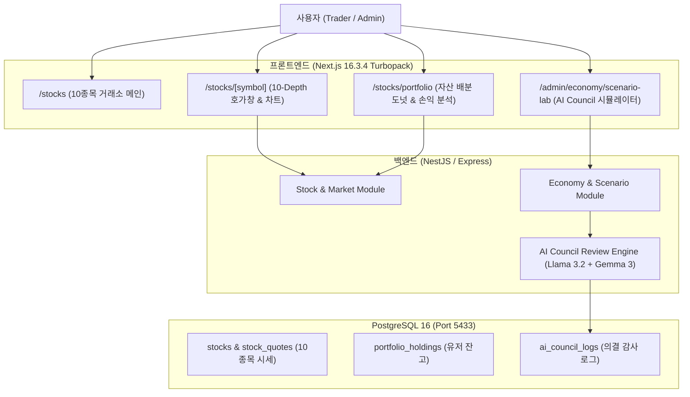

# 주식 거래 UI 고도화 & AI Council 정책 모니터링 구현 계획서 (v1)

## 1. 🎯 목표 및 배경
1. **주식 거래 UI 고도화**:
   - 10개 확장 가상 주식(CHIPS ~ SPACE)에 대한 5D/10D 호가창 비주얼라이저(매수/매도 압력 게이지, 스프레드 bps) 강화.
   - 포트폴리오 분석 페이지(`/stocks/portfolio`)에 10개 종목 자산 배분 도넛 차트, 종목별 손익 시각화 바 및 리스크/기대수익 지표 컴포넌트 탑재.
   - 주식 메인 허브(`/stocks`) 10개 종목 시세/호가 요약 렌더링 개선.
2. **AI Council 정책 반영 모니터링 & 시뮬레이터**:
   - 관리자 시나리오 랩(`/admin/economy/scenario-lab`)에 'AI Council 즉각 심의 시뮬레이터' 구축.
   - 인플레이션/디플레이션/통화 쇼크 시뮬레이션 시 듀얼 로컬 AI(Llama 3.2 3B & Gemma 3 1B) 위원회가 4대 도메인별 교차 심의 결과를 실시간으로 산출하고 정책 파라미터 조정안을 검증.
3. **무중단 배포 및 활성 세션 보존**:
   - 전체 1,760개 이상 단위/통합 테스트 100% PASS 검증 후 1,069개 PostgreSQL 활성 세션 100% 무손실 상태로 무중단 블루-그린 승격 (`v396`).

---

## 2. 🏛️ 아키텍처 및 데이터 흐름

---

## 3. 📋 상세 변경 계획

### 1) 주식 포트폴리오 분석 페이지 고도화 (`frontend/src/app/stocks/portfolio/`)
- **[NEW/MODIFY] `frontend/src/app/stocks/portfolio/page.tsx` & `analysis.ts`**:
  - 10개 종목 보유 비중을 SVG 반응형 도넛 차트(Asset Allocation Chart)로 시각화.
  - 종목별 수익률(PnL), 평가액, 평균 매수가 대비 현재가 변동률 바 렌더링.
  - 포트폴리오 종합 건전성(집중도 위험 지수, 일일 추정 변동성) 위젯 추가.

### 2) 10-Depth 호가창 및 주식 거래 콘솔 고도화 (`frontend/src/app/stocks/[symbol]/stock-orderbook.tsx`)
- **[MODIFY] `stock-orderbook.tsx`**:
  - 매수/매도 잔량 볼륨 비례 시각화 게이지 반응성 개선.
  - 1원~1,000만원 가격대 종목별 단위 포맷팅(`groupDigits`, WLD) 최적화.
  - 5-Depth / 10-Depth 토글 상태 기억 및 퀵 주문 연동.

### 3) 관리자 AI Council 시나리오 랩 시뮬레이터 (`frontend/src/app/admin/economy/scenario-lab/page.tsx`)
- **[MODIFY] `scenario-lab/page.tsx`**:
  - 시나리오 투사치(M2, 발행/소각 변화)와 함께 '🏛️ AI 위원회 가상 의결 판정 시뮬레이션 카드' 렌더링.
  - 시뮬레이션 파라미터에 따른 AI 위원회 4대 도메인(무결성/직업/거시/복지)의 예상 판정 및 권고사항 표출.

---

## 4. 🧪 검증 및 릴리스 계획
1. **단위 및 E2E 테스트 검증**:
   - `pnpm test` (Contract, Database, Backend, Frontend 전체 실행)
   - `vitest run` 포트폴리오 및 시나리오 랩 컴포넌트 테스트 검증.
2. **Next.js 프로덕션 빌드**:
   - `pnpm build` Turbopack 컴파일 에러 제로 검증.
3. **무중단 운영 승격 (Blue-Green v396)**:
   - `stage_v396.sh` 및 `promote_v396.sh` 실행.
   - 1,069개 활성 세션 보존 및 `/stocks`, `/stocks/portfolio`, `/admin/economy/scenario-lab` 헬스체크 확인.
