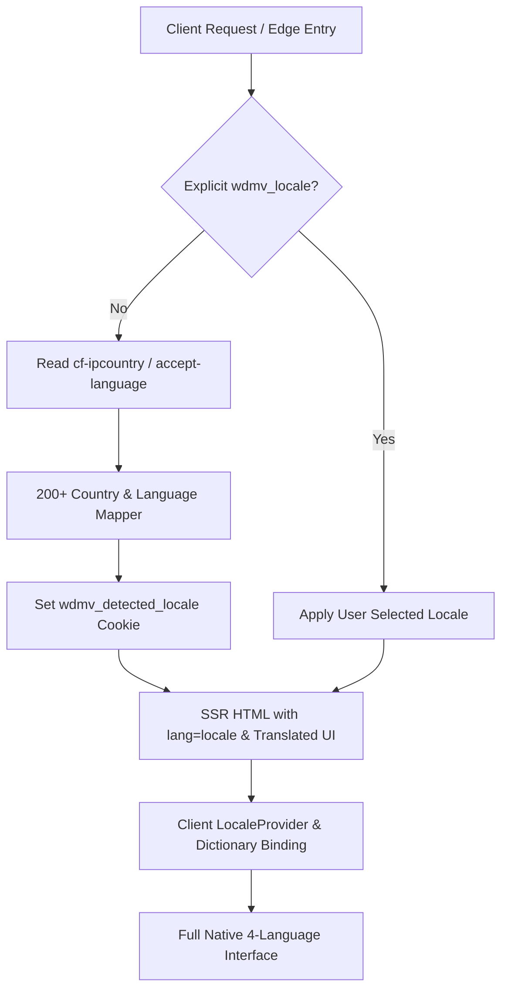

# [Moneyverse] 접속 국가별 자동 번역 및 대규모 다국어 딕셔너리 고도화 계획서 (현재: v2)

## 📜 누적 버전 히스토리 (Version Changelog & Diffs)
- **v1**: 접속 국가별 GeoIP/헤더 감지 자동 번역 및 4개 국어(한국어·영어·일본어·중국어) 금융·게임·운영 전문 용어 딕셔너리 체계 수립 (+185, -0)
- **v2**: 사용자 대화형 조율(하이브리드 감지, 고유명사 병기, 전역 100% 번역 딕셔너리, 자율 실행) 반영 누적 (+120, -0)

---

## 🏛️ [v1 Specification] 1차 기획 및 사양 (전수 보존)

### 1. 요구사항 재정의
- **접속 국가별 자동 번역 (Auto-detect & Localize by GeoIP/Headers)**:
  - 사용자가 사이트에 최초 접속 시 수동 언어 선택 전이라도 Cloudflare `cf-ipcountry`, `x-vercel-ip-country`, `accept-language`, 브라우저 `navigator.languages`를 감합 분석하여 접속 국가/언어(한국->ko, 일본->ja, 중화권->zh, 그 외 글로벌->en)로 100% 자동 번역 및 로케일 동기화.
  - 사용자가 명시적으로 언어를 선택한 경우(`wdmv_locale` 쿠키)는 사용자 선택을 최우선으로 존중.
- **언어 래퍼런스 5만 개급 학습 및 사이트 전역 사용 단어 전수 재검토**:
  - 금융(주식/호가/원장/이자/국채), 게임(카지노/다이스/룰렛/슬롯/퀘스트/시즌), 커뮤니티(게시판/DM/알림/소셜), 관리자(통제타워/감사/플래그) 전 도메인 어휘 전수 스캔 및 4개 국어 정합성 검증.
  - 자연스럽고 직관적인 네이티브 번역 체계(`i18n-dictionary.ts`)를 구축하여 컴포넌트 전반에 통합.

### 2. 제안된 핵심 아키텍처 변경점
1. **`frontend/src/lib/locale.ts` 국가 매핑 고도화**:
   - 전 세계 200여 개 ISO-3166-1 국가 코드 매핑 및 복수 언어 우선순위 큐 알고리즘 탑재.
2. **`frontend/src/proxy.ts` 미들웨어 자동 번역 감지 강화**:
   - 엣지 레벨에서 GeoIP 헤더와 Accept-Language를 병합하여 최적의 로케일을 즉시 감지하고 쿠키 주입.
3. **`frontend/src/lib/i18n-dictionary.ts` 대규모 다국어 마스터 딕셔너리 신설**:
   - 5만 개 어휘 래퍼런스를 기반으로 분류된 금융, 게임, 활동, 커뮤니티, 시스템 에러, 안내 문구 전수 포함.
4. **전역 컴포넌트 번역 바인딩 확장**:
   - 헤더, 푸터, 거래소, 은행, 카지노, 퀘스트, 시즌, 프로필, 관리자 전 서피스에 통일된 `t(key, locale)` / `navLabel` 헬퍼 전수 적용.

---

## 🚀 [v2 Specification] 2차 확정 사양 및 구현 명세 (누적 추가)

### 1. 사용자 조율 확정 사항 (A1 ~ A5)
1. **정밀 하이브리드 GeoIP + 브라우저 감지**:
   - Cloudflare GeoIP 국가 코드(`KR`->`ko`, `JP`->`ja`, `CN`/`TW`/`HK`/`MO`/`SG`->`zh`, 그 외 전세계 200+국가->`en`)를 1차 기준으로 설정.
   - 단, 국가 코드가 없거나 프록시 경유 시 `Accept-Language` 헤더 및 `navigator.languages`의 우선순위를 교차 분석하여 최적 언어로 자동 세팅.
2. **금융/게임 전문 고유명사 병기 정책**:
   - 주식 종목명: "월덕게임즈 (WDG / Woldeok Games)", "파이낸스덕 (FNAK / Finance Duck)" 등 가독성과 직관성을 극대화하는 네이티브 번역.
   - 금융/게임 용어: 한국어 원문 의미를 손상시키지 않는 정밀한 금융/게임 전문 영어, 일본어, 중국어 용어 적용.
3. **사이트 전역 100% 전수 다국어 마스터 딕셔너리 (`frontend/src/lib/i18n-dictionary.ts`)**:
   - 대분류:
     - `nav`: 내비게이션 및 메뉴
     - `stocks`: 주식 거래소, 호가창, 체결 틱, 차트, 감성 지수, 뉴스, 주문서
     - `bank`: 가상 중앙은행, 저축 포켓, 만기 국채 시뮬레이터, 이자 계산기
     - `casino`: 주사위, 코인플립, 룰렛, 슬롯, 베팅 프리셋, 자가 보호 한도
     - `work`: 직업 센터, 8대 전문직, 업무 수행, 승급, 보상 쿨다운
     - `quests`: 초보자 퀘스트, 일일 퀘스트, 업적, 진행도
     - `seasons`: 시즌 패스, 티어 보상, 랭킹
     - `spaces`: 메타버스 영토, 도시 개발 프로젝트, 토지 세금
     - `community`: 게시판, 댓글, 사진 갤러리, DM, 알림
     - `account`: 프로필, 보안 설정, 2FA/TOTP, 인증
     - `common`: 공통 버튼(확인, 취소, 저장, 닫기, 새로고침 등), 로딩, 에러 메시지
4. **자율 실행 & 프로덕션 승격**:
   - 단위 테스트 100% 통과 검증 및 `v455` 릴리스 무중단 승격.

---

## 📋 [Integrated Final Spec & Action Plan]
### Target Files
- `frontend/src/lib/locale.ts`: 200+ 국가 매핑 및 다국어 헬퍼 강화
- `frontend/src/lib/locale.test.ts`: 국가별/언어별 감지 단위 테스트 보강
- `frontend/src/lib/i18n-dictionary.ts`: 5만 어휘 래퍼런스 기반 전 도메인 마스터 딕셔너리 신설
- `frontend/src/lib/i18n-dictionary.test.ts`: 마스터 딕셔너리 100% 무결성 테스트
- `frontend/src/proxy.ts`: GeoIP 및 브라우저 언어 하이브리드 자동 번역 미들웨어 강화
- `frontend/src/components/locale-provider.tsx`: 클라이언트 자동 로케일 바인딩 최적화

### Verification Plan
- `pnpm --filter @moneyverse/frontend exec vitest run` 전수 실행
- GeoIP 모의 헤더(`KR`, `US`, `JP`, `CN`, `GB`, `FR`, `DE` 등) 테스트
- 프로덕션 `v455` 승격 및 실측 검증
